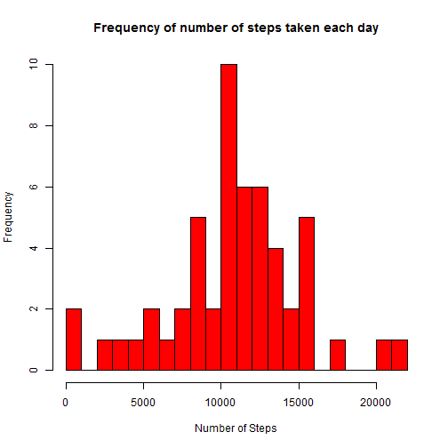
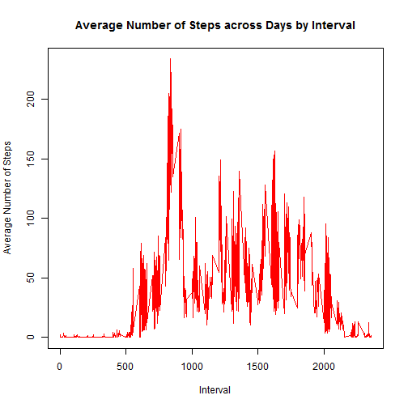
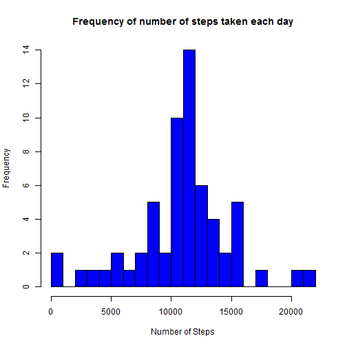
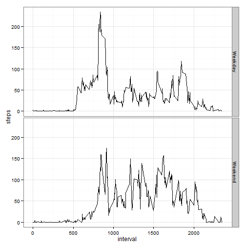

# Reproducible Research: Peer Assessment 1

## Loading and preprocessing the data


```r
activity <- read.csv("activity.csv", header = T)
head(activity)
```

```
##   steps       date interval
## 1    NA 2012-10-01        0
## 2    NA 2012-10-01        5
## 3    NA 2012-10-01       10
## 4    NA 2012-10-01       15
## 5    NA 2012-10-01       20
## 6    NA 2012-10-01       25
```


```r
activity$date <- as.Date(activity$date)
activity$weekdays <- weekdays(activity$date)
activity$wfactor <- activity$weekdays == "Sunday" | activity$weekdays == "Saturday"
activity$wfactor[activity$wfactor == T] <- "Weekend"
activity$wfactor[activity$wfactor == F] <- "Weekday"

library(reshape2)
activityMelt <- melt(activity, c("date", "wfactor", "interval"), c("steps"), 
    na.rm = T)

# Q1: number steps taken by day
stepsdata <- dcast(activityMelt, date ~ variable, sum)

# Q2-Q4: Average number of steps (across days) by interval
avgdata <- dcast(activityMelt, interval + wfactor ~ variable, mean)
```


## What is mean total number of steps taken per day?


```r
hist(stepsdata$steps, main = "Frequency of number of steps taken each day", 
    xlab = "Number of Steps", breaks = 30, col = "red")
```

 


The above distribution mean and median are:


```r
mean <- mean(stepsdata$steps)
median <- median(stepsdata$steps)
```


```r
mean
```

```
## [1] 10766
```

```r
median
```

```
## [1] 10765
```


## What is the average daily activity pattern?

Time series plot of the 5 min interval and the average number of steps across days:


```r
plot(avgdata$interval, avgdata$steps, type = "l", xlab = "Interval", ylab = "Average Number of Steps", 
    main = "Average Number of Steps across Days by Interval", col = "red")
```

 


The 5-min interval that contains, on average, the maximum number of steps is:


```r
max <- avgdata[which.max(avgdata$steps), "interval"]
max
```

```
## [1] 835
```


## Imputing missing values


```r

copy <- activity

for (i in which(is.na(copy$steps))) {
    int <- copy[i, "interval"]
    copy[i, "steps"] <- mean(avgdata[avgdata$interval == int, "steps"])
}

head(copy)
```

```
##     steps       date interval weekdays wfactor
## 1 1.16667 2012-10-01        0   Monday Weekday
## 2 0.23077 2012-10-01        5   Monday Weekday
## 3 0.08974 2012-10-01       10   Monday Weekday
## 4 0.10256 2012-10-01       15   Monday Weekday
## 5 0.05128 2012-10-01       20   Monday Weekday
## 6 2.61355 2012-10-01       25   Monday Weekday
```


Now, let's calculate the sum of steps taken by day and generate a histogram using this "copy" dataset (which looks like the activity dataset used in Q1, but with the missing values filled in). Then, we can check the mean and median values.


```r
copyMelt <- melt(copy, c("date", "interval"), "steps", na.rm = T)
stepscopy <- dcast(copyMelt, date ~ variable, sum)

hist(stepscopy$steps, main = "Frequency of number of steps taken each day", 
    xlab = "Number of Steps", breaks = 30, col = "blue")
```

 

```r

mean(stepscopy$steps)
```

```
## [1] 10835
```

```r
median(stepscopy$steps)
```

```
## [1] 11292
```


Apparently, inputting averages do not change dramatically either the graph or the distribution mean and median (11000ish).

## Are there differences in activity patterns between weekdays and weekends?


```r
library(ggplot2)
g <- ggplot(avgdata, aes(interval, steps))
g + geom_line() + facet_grid(wfactor ~ .) + theme_bw()
```

 
